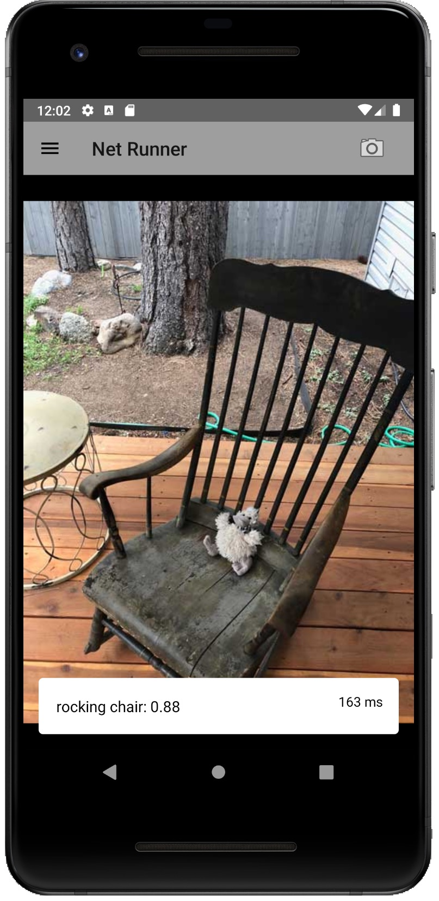

## Net Runner

Net Runner is an Android environment for running and evaluating computer vision machine learning models on device. Net Runner currently supports TensorFlow Lite models and works on API 22 (Android 5.1 Lollipop) or higher.

Data scientists can run their own models in Net Runner without needing to know any Android specific code, while developers will find a sophisticated and flexible library underneath the hood in the form of [Tensor/IO](https://github.com/doc-ai/tensorio).

We happen to think it looks pretty good too. And if that latency number worries you, it's because this is a screenshot from the simulator. On a first generation Google Pixel, MobileNet V2 classification models perform inference on the GPU in roughly 50ms.



## Table of Contents

* [ Overview ](#overview)
* [ Requirements ](#requirements)
* [ Installation ](#installation)
* [ Author ](#author)
* [ License ](#license)
* [ Basic Usage ](#basic-usage)
* [ Data Scientists Start Here ](#data-scientists)
	* [ Freezing a Model ](#freeze-model)
	* [ Converting a Model to TensorFlow Lite ](#toco-convert)
	* [ Preparing a TF Lite Model for Net Runner ](#prep-net-runner) 
	* [ Adding a Model To Net Runner ](#add-model)
* [ Developers Start Here ](#developers)
	* [ Model Evaluators ](#model-evaluators) 
	* [ Tensor/IO ](#tensor-io)
	* [ Adding Your Own Models ](#models-directory)
	* [ Custom Output ](#custom-output)

<a name="overview"></a>
## Overview

Net Runner is an environment for evaluating machine learning models on device. It enables the rapid prototyping and verficiation of computer vision machine learning models without a lot of boilerplate code. In fact, with the help of [Tensor/IO](https://github.com/doc-ai/tensorio) you can run your vision models in Net Runner with just a little JSON.

<a name="requirements"></a>
## Requirements

Net Runner requires API 22+ (Android 5.1 Lollipop or higher) and Android Studio 4.0 or higher.

<a name="installation"></a>
## Installation

Clone or download this repo and open the root directory in Android Studio. Select the *app* configuration and run.

<a name="author"></a>
## Author

Net Runner is by [doc.ai](https://doc.ai/).


Development by Philip Dow (philip@doc.ai)

<a name="license"></a>
## License

Net Runner is available under the Apache 2 license. See the LICENSE file for more info.

<a name="basic-usage"></a>
## Basic Usage

Net Runner ships with five MobileNet models for image classification. The application launches with a MobileNet V2 model and the back facing camera feeding image data into it. The model can classify 1000 objects, and Net Runner shows the top five classifications with a probability over 0.05.

Net Runner measures the model's latency and continuously outputs an average value. On an Google Pixel the average GPU latency of the MobileNet V2 model should be ~50ms.

By default Net Runner performs inference on the data coming from the back camera. Tap the flip button to change camera directions. Tap the pause|play button to pause and restart the feed.

To change the capture source, tap the camera icon at the top right. You may take a photo or choose a photo from the photo gallery on the device.

Tap the options icon at the top left to change the model you are running and other model settings.

<a name="data-scientists"></a>
## Data Scientists Start Here

Net Runner is designed to be easy to use for computer vision data scientists and without the need for any TensorFlow Lite or Android specific code. That means no C, C++, Java, or Kotlin. Instead, model builders describe their models using JSON with information that is already familiar to them, such as tensor shapes and data transformations.

There is still something of a process to get to that point, which looks like:

1. Develop your TensorFlow model
2. Save your model
3. Convert your saved model to a frozen model
4. Convert the frozen model to a TensorFlow Lite model
5. Prepare your TensorFlow Lite model for Net Runner

A guide to assist data scientists with these steps is forthcoming, but the following information will help you get started. See especially the [TF Lite Developer Guide](https://www.tensorflow.org/mobile/tflite/devguide) at tensorflow.org for information on freezing a model and converting it to the TensorFlow Lite format.

<a name="freeze-model"></a>
### Freezing a Model

Convert a saved model to a frozen model with the `freeze_graph` command line utility, which is included with python installations of TensorFlow. 

A frozen graph is one in which trainable variables have into transformed and "frozen" into constants that are then packaged into a single protobuf file along with the graph. It is a model format that is optimized for and suited to inference only.

<a name="toco-convert"></a>
### Converting a Model to TensorFlow Lite (TF Lite)

Once you have frozen your model convert it to the TensorFlow Lite format using the `toco` command line utility, also included with python installations of TensorFlow. 

TensorFlow Lite is a TensorFlow environment for mobile and embedded use cases and is how models are run on iPhone and Android devices. TensorFlow Lite models do not support all tensor operations, but most convolution operations are available, and if you are beginning with a MobileNet or Inception ResNet model you should be fine.

<a name="prep-net-runner"></a>
### Preparing a TF Lite Model for Net Runner

At this stage you could use your model with the TensorFlow Lite library directly, but that would involve programming in Objective-C++ for an iPhone and Java and C++ on Android. Instead, Net Runner uses [Tensor/IO](https://github.com/doc-ai/tensorio), a framework also developed by doc.ai for the rapid deployment of TensorFlow Lite and TensorFlow models to iOS devices and TensorFlow Lite models to Android devices.

With Tensor/IO you describe your model's input and output layers using JSON. Net Runner can then automatically prepare camera and image data for inference and capture your model's output in the correct format.

Refer to the included *.tfbundle* folders in the *models* directory found in this repo for examples, and see especially the [section on Tensor/IO](#tensor-io) below for details on preparing your TF Lite models for Net Runner.

<a name="add-model"></a>
### Adding a Model to Net Runner

You can download your own models directly into Net Runner. Make sure your model has been propertly prepared and is wrapped in a *.tfbundle* with a *model.json* description and any other assets, then zip the *.tfbundle* folder using a utility like gzip or the macOS Finder's Compress utility. 

Upload the zipped bundle to website you can access, and then from within Net Runner, go to Options (top left) and select Manage Models. At the top right of the Manage Models table, tap the Plus button. Enter the URL and then tap OK.

Net Runner will download, unzip, and validate your model, and if it can be run in the app, will import it and make it available for selection. Note that Net Runner is designed specifically for computer vision applications, so your models should take a single input of type image.

<a name="developers"></a>
## Developers Start Here

Net Runner is designed for turnkey use without the need to write any additional code. If you would, however, like to perform custom data transformations on your model's output, format your model's output in a more human readable way, or extend the underlying [Tensor/IO framework](https://github.com/doc-ai/tensorio), some coding may be necessary.

By default, Net Runner displays a model's output by parsing the resulting Map and formatting primitves and collections as best it can. Image classification outputs have their own special format. If you require custom output formatting, refer to the section on [custom output](#custom-output).

If you would like to contribute to Tensor/IO, the underlying framework that allows users to describe their models with JSON rather than write custom Java or Kotlin code, head on over to the [Tensor/IO repository](https://github.com/doc-ai/tensorio) or straight to our [Tensor/IO Android repo](https://github.com/doc-ai/tensorio-android).

<a name="model-evaluators"></a>
### Performing Inference: Model Evaluators

Net Runner defers all model inference to classes that implement the `Evaluator` protocol, and Net Runner includes support for evaluating album photos, files, instances of `UIImage`, and instances of `CVPixelBufferRef`. Support for performing inference on images identified by URLs is forthcoming. Ultimately, all model evaluators defer to the `CVPixelBufferEvaluator`, which performs inference on a pixel buffer. 

Evaluators return information such as the model output, latency, and image preprocessing latency, as well as a unique identifier such as the filepath or album photo id, and any errors that occurred. See the *Evaluation* group in the Xcode and especially *CVPixelBufferEvaluator.m* for more information.

<a name="tensor-io"></a>
### Tensor/IO

Net Runner includes [Tensor/IO](https://github.com/doc-ai/tensorio-android) as a dependency. Tensor/IO is a framework for deploying TensorFlow Lite models on Android. It abstracts the work of transforming data and copying bytes into and out of tensor buffers, replacing that with a native Java or Kotlin interface and a JSON description of the underlying model.

The following JSON describes the MobileNet V2 model that ships with Net Runner. Notice in particular the *inputs* and *outputs* fields:

```json
{
  "name": "MobileNet V2 1.0 224",
  "details": "MobileNet V2 with a width multiplier of 1.0 and an input resolution of 224x224. \n\nMobileNets are based on a streamlined architecture that have depth-wise separable convolutions to build light weight deep neural networks. Trained on ImageNet with categories such as trees, animals, food, vehicles, person etc. MobileNets: Efficient Convolutional Neural Networks for Mobile Vision Applications.",
  "id": "mobilenet-v2-100-224-unquantized",
  "version": "1",
  "author": "Andrew G. Howard, Menglong Zhu, Bo Chen, Dmitry Kalenichenko, Weijun Wang, Tobias Weyand, Marco Andreetto, Hartwig Adam",
  "license": "Apache License. Version 2.0 http://www.apache.org/licenses/LICENSE-2.0",
  "model": {
    "file": "mobilenet_v2_1.4_224.tflite",
    "quantized": false,
    "type": "image.classification.imagenet"
  },
  "inputs": [
    {
      "name": "image",
      "type": "image",
      "shape": [224,224,3],
      "format": "RGB",
      "normalize": {
        "standard": "[-1,1]"
      }
    },
  ],
  "outputs": [
    {
      "name": "classification",
      "type": "array",
      "shape": [1,1000],
      "labels": "labels.txt"
    },
  ]
}
```

The model is used in Kotlin as follows:

```kotlin
// Load the Model

val bundle = ModelBundle(applicationContext, "mobilenet_v2_1.4_224.tiobundle")
val model = bundle.newModel()

// Load an Image

val stream = assets.open("elephant.jpg")
val bitmap = BitmapFactory.decodeStream(stream)

// Run the Model

val output = model.runOn(bitmap)

// Get the Results

val classification = output.get("classification") as MutableMap<String, Float>
val top5 = ClassificationHelper.topN(classification, 5, 0.1f)
val label = top5.get(0).key
```

<a name="models-directory"></a>
### Adding Your Own Models

Net Runner automatically looks for *.tiobundle* folders inside the packaged assets directory. It makes those models available for selection in the options navigation drawer.

To add your own model to Net Runner, create a *model.json* file for it and include both the model and the JSON file in a *.tiobundle* folder. Add any additional assets, and then add the folder to your projects assets directory.

For example, the included MobileNet V2 model has the following directory structure:

```
- mobilenet_v2_1.4_224.tfbundle
  - mobilenet_v2_1.4_224.tflite
  - model.json
  - assets
    - labels.txt
```

If your model expects a single input layer of image data, Net Runner will know how to use it without any additional code. If you have a single output layer, you can probably get by with copying the *model.json* file from one of the included models and making small changes to it. Net Runner will then display your model's output at the bottom of the screen.

For more information on how to describe your model in the *model.json* file, and for additional details on packaging your models in a *.tfbundle* folder, refer to the [Tensor/IO documentation](https://github.com/doc-ai/tensorio#model-json).

<a name="custom-output"></a>
### Custom Output

By default Net Runner tries to format your model's output in the info section at the bottom of the screen as best it can, parsing collections (lists) and primitives into readable values. If you would prefer to format this output, refer to the *ai.doc.netrunner.outputhandler* package in the app module.

You will first create a class that extends `Fragment` and conforms to the `OutputHandler` interface. Create a corresponding layout file for it as well and inflate it in `onCreateView`. Override the setter for the `output` property and perform any custom formatting and presentation here. See the `DefaultOutputHandler` and `ImageNetClassificationOutputHandler` for examples.

You must also register your output handler with the `OutputHandlerManager`. Add your model type and handler class to the `registerHandler` function:

```kotlin
fun registerHandlers() {
        registerHandler(DefaultOutputHandler.type, DefaultOutputHandler::class.java)
        registerHandler(MobileNetClassificationOutputHandler.type, MobileNetClassificationOutputHandler::class.java)
        
        // your handler here
    }
```

The manager uses the *model.type* field in the model's JSON description, so that you can register a single output class for multiple models. 

For example, refer to the model.json file for the MobileNet model above and you will see a type field in the model dictionary:

```json
"model": {
    "file": "mobilenet_v2_1.4_224.tflite",
    "quantized": false,
    "type": "image.classification.imagenet"
  },
```

The `MobileNetClassificationOutputHandler` is registered for the same type string:

```kotlin
class MobileNetClassificationOutputHandler : Fragment(), OutputHandler {

    companion object {
        val type = "image.classification.imagenet"
    }
    
    // ...
}
```

Because the output handlers use a fragment for displaying their formatted output, you may display whatever you want in the output, not just a textual representation.